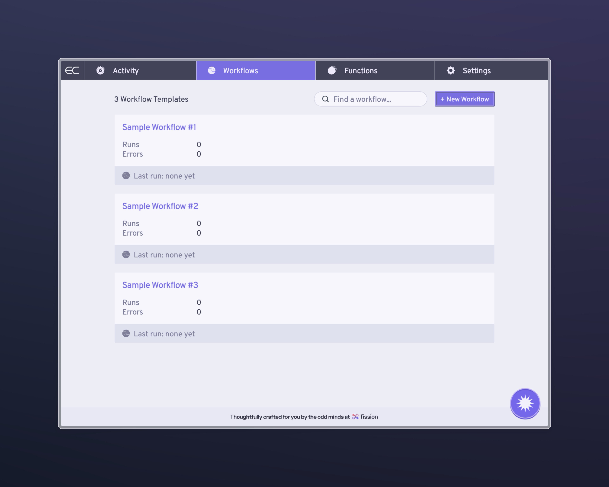
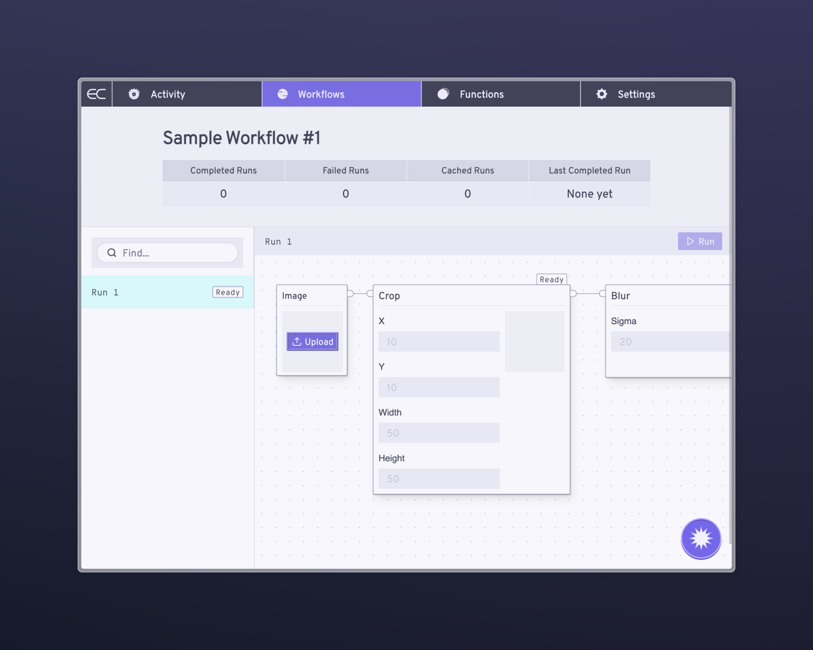
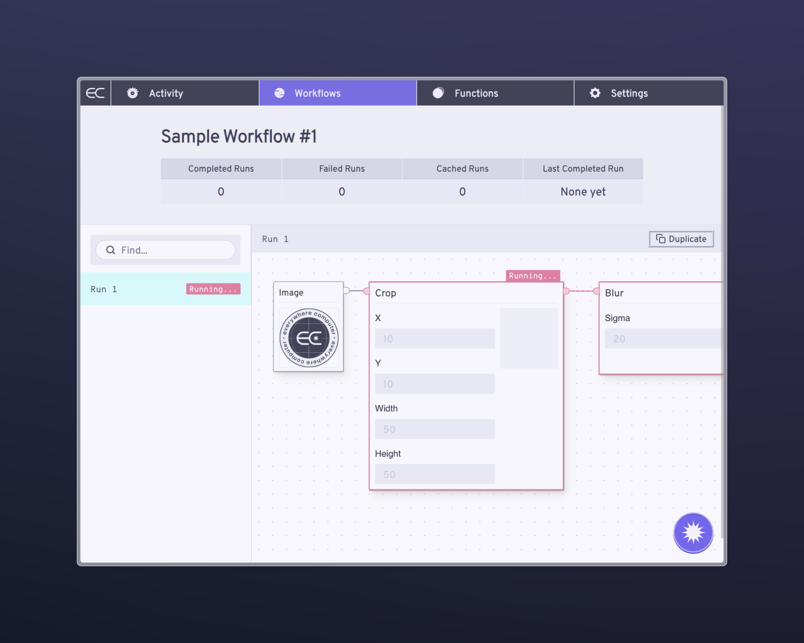

The Everywhere Computer works by running workflows: sequences of functions you'll write to accomplish your compute jobs. They can be big. They can be small. They can run in isolation.  They can be composed together.

There's a lot to explore about them, but let's just start by running a sample workflow via the Control Panel. Assuming you have created your account, the Control Panel ships with 3 sample workflows that make use of the functions we added when we setup our local `homestar` node: [https://control.everywhere.computer/workflows/](https://control.everywhere.computer/workflows/)

You can choose any of the available workflows, all of which use our sample image manipulation functions. Let's just go ahead with Sample Workflow #1. All you need to do is:

1. Upload an image, and then&#x20;
2. Hit the `Run` button

Once you have hit `Run`, you should see the workflow in `Running...` mode.

Shortly, your first workflow run should be `complete`. And you should be able to view the output: a cropped and blurred version of your original input image.

Painless, right? Now let's work on [customizing that workflow](customize-a-workflow).
