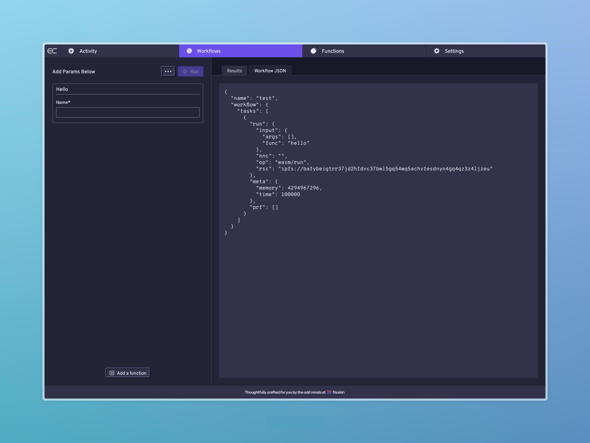
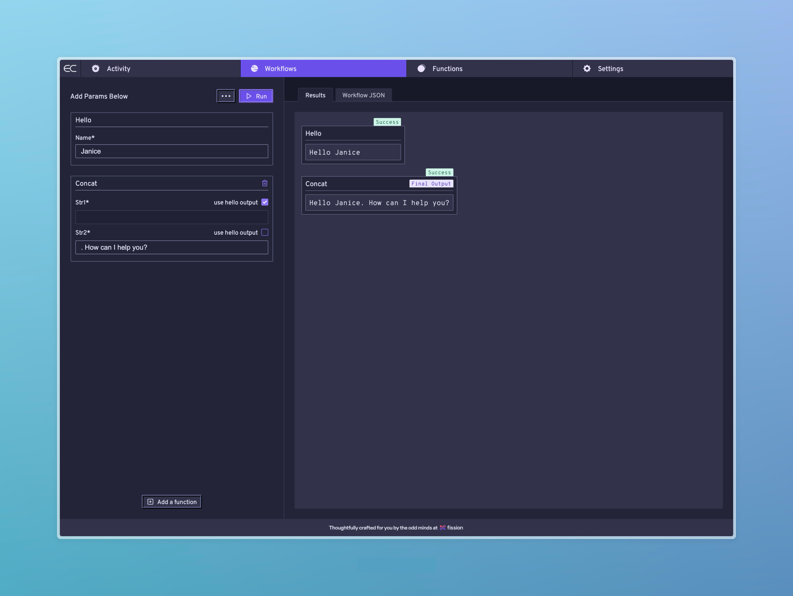

Get introduced to the Everywhere Computer's core concepts while using the `every cli` to write and run custom functions on your local machine:

```shell
npm i -g @everywhere-computer/every-cli
```

## Setup & Run a Local IPFS Node

The Everywhere Computer is both portable and durable. These two traits are made possible by [IPFS’ content addressing](https://fission.codes/blog/content-addressing-what-it-is-and-how-it-works/) and WebAssembly's ability to execute in _any_ environment — including browsers.

If you are not already running an IPFS Kubo node on your local machine:
1. Download & install the [IPFS Desktop](https://docs.ipfs.tech/install/ipfs-desktop/) client.
2. Launch the IPFS Desktop client — this will ensure an IPFS node is running on your local machine.

## Run Your First Function

Clone down our [custom TypeScript functions repo](https://github.com/everywhere-computer/custom-homestar-functions-ts). In the `src/functions` directory you'll find four *very* basic functions:
1. `add.ts` - adds two numbers together
2. `concat.ts` - concatenates two strings
3. `hello.ts` - a simple `hello ${world}`
4. `message-and-number.ts` - concatenates together a string and a number

### Boot Up The Everywhere Computer

Let's begin with `hello.ts`. From the root directory of the repository run:

```shell
every dev --fn src/functions/hello.ts
```

This should produce an output like the following in your terminal:
```bash
✔ Functions parsed and compiled
✔ Homestar is running at http://127.0.0.1:8020
✔ Control Panel is running at https://control.everywhere.computer

◐ Starting cloudflared tunnel to http://127.0.0.1:3000/                                                                                                    

... a QR code ...

➜ Local:    http://127.0.0.1:3000/
➜ Tunnel:   https://sometimes-comical-word-set.trycloudflare.com
```

Everything is now ready to run your function:
1. **The function has been compiled to WebAssembly (Wasm)** which is the Everywhere Computer's native format.
2. **A local Homestar node** is running — these are what power the Everything Computer.
3. **A local instance of the Control Panel** is running so that we can interact with our local Homestar node.
4. **A Cloudflare tunnel** has been opened, enabling your function to be called over the public internet via an HTTP Gateway.

### Run `hello` From The Control Panel

Visit your local Control Panel at [https://control.everywhere.computer](https://control.everywhere.computer). You should see the following interface:



Enter a name and hit the "Run" button. You should see your first result!

You may have noticed it took a moment to compile the result. Because of the Everywhere Computer's memoization, that result is now cached. If you hit run again, it should be nearly instantaneous — we skipped straight to the result.

### Run `hello` From Your Phone

Take out your phone and scan the QR code from your terminal. This will open the Cloudflare tunnel on your device.

Append `hello?name=Gary` to the url (eg. https://YOUR-TUNNEL-URL/hello?name=test). Because of the content type of the response, your browser will likely download (or prompt you to download) a text file that reads "Hello Gary".

Congrats! You've just run the Everywhere Computer over the internet.

## Write A Multi-Function Workflow

When you called that first sample function, it was wrapped with the input you proved as a `task` and executed as part of a `workflow`: a sequence of functions that define compute jobs to be run on the Everywhere Computer. Just to repeat:

1. **A Function:** The code you've written that accepts inputs and returns an output
2. **A Task:** Function + a specific set of Inputs
3. **A Workflow:** Multiple tasks run in sequence

Workflows can be big. They can be small. They can run in isolation. They can be composed together.

Let's construct a two task workflow to test this out. To do this, we'll instruct the cli to compile both the `hello` and `concat` functions:

```shell
every dev --fn src/functions/hello.ts --fn src/functions/concat.ts
```



## Next Steps

For additional instructions on local development with the `every cli` — including writing custom functions in TypeScript and Rust — check out [Every CLI Usage](/everycli/local-dev).